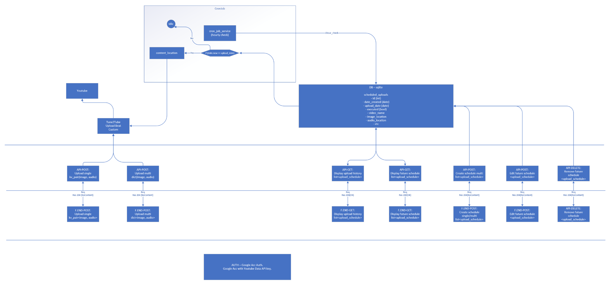

# High-Level Architecture Document

## Overview

The **SoundFrame** application is designed to facilitate the seamless upload of image-audio content to YouTube. It combines frontend, backend, database management, and automated scheduling mechanisms to provide an end-to-end solution for content upload and scheduling.

---

## High-Level Diagram

The following diagram illustrates the high-level architecture of the application:

---

## Components

### 1. **Frontend**
- Allows users to:
  - Upload single or multiple key-value pair files (images, audio).
  - Schedule uploads for a specific date and time.
  - View upload history and scheduled tasks.
- Communicates with the backend via RESTful APIs.

**Key Features:**
- File Upload UI
- Scheduling UI
- History View

---

### 2. **Backend**
- Serves as the core application layer, handling:
  - File uploads for single and multiple key-value pairs (image, audio).
  - Creation, modification, and deletion of upload schedules.
  - Fetching upload history and scheduled content.
  - Google authentication and YouTube API integration.
- Key APIs include:
  - **POST**: Upload single/multiple files
  - **POST**: Schedule uploads
  - **GET**: Fetch upload history
  - **GET**: Fetch future schedules
  - **DELETE**: Remove scheduled uploads

---

### 3. **Database**
- A lightweight SQLite database to store:
  - Upload schedules
  - File locations (images, audio)
  - Execution status
  - Upload history
- Table: `scheduled_uploads`
  - `id` (int)
  - `date_created` (date)
  - `upload_date` (date)
  - `executed` (bool)
  - `video_name`
  - `image_location`
  - `audio_location`
  - `etc`

---

### 4. **Scheduler**
- A cron job service periodically checks for uploads scheduled for the current time.
- Executes uploads using the YouTube API integration.

**Flow**:
1. Cron job checks the database hourly.
2. On match with `upload_date`, uploads content to YouTube.
3. Marks the `executed` field as `True`.

---

### 5. **Authentication**
- Google Account Authentication via OAuth.
- Enables access to the YouTube Data API for upload functionality.

---

## Workflow

1. **File Upload**:
   - User uploads files (single/multi).
   - Files are stored, and metadata is added to the database.

2. **Schedule Upload**:
   - User schedules upload by providing a future date.
   - Scheduler checks and triggers the upload when the time is met.

3. **YouTube Upload**:
   - Content (image + audio) is processed and uploaded as a video to YouTube.

4. **History and Status**:
   - User can fetch upload history or scheduled uploads.

---

## Future Considerations
- Enhance the scheduler to use message queues for scalability.
- Support additional video and audio formats.
- Integrate advanced logging and monitoring features.

---
